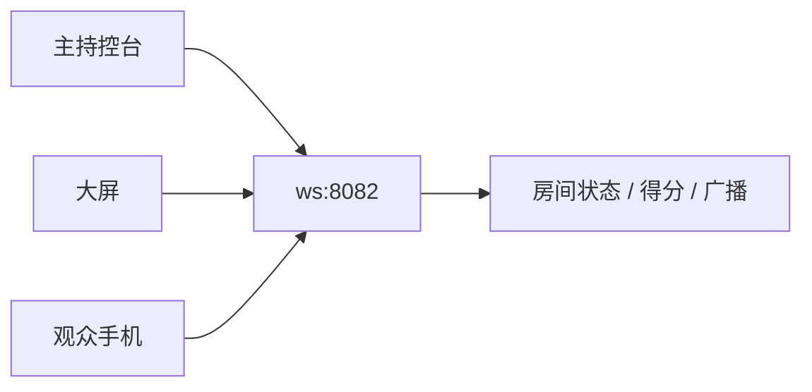

# quiz-live 趣味常识挑战

独立于 Reveal 主 deck 的现场自答抢答系统。观众扫码登记、自选类别、随机 10 题自答；主持端实时看分与广播；大屏展示排行榜与滚屏广播。

## 三端架构

| 端 | 文件 | 职责 |
|----|------|------|
| 观众手机 | `quiz-live/answer.html?room=XXXX` | 昵称登记、选类别、答题、排行榜 |
| 主持控台 | `quiz-live/admin.html?room=XXXX` | 房间码、二维码、得分表、清除数据、最近广播 |
| 现场大屏 | `quiz-live/screen.html?room=XXXX` | 在线人数、参与者格、排行榜、广播条 |

实时同步经 **WebSocket 中继**（`quiz-live/scripts/quiz-ws-relay.js`，默认端口 **8082**）。



## 观众流程

1. 扫描控台二维码，打开 `answer.html?room=房间码`。
2. **登记昵称**（`register-config.json` 驱动表单；本地可缓存，显示「以 xxx 继续」）。
3. **选择挑战类别**（游戏 / 动画 / 留学 / 做菜 / 艺术史等，来自题库 `categoryMeta`）。
4. 每局 **随机 10 题**：点选项 → **确定** → 即时对错反馈 → **下一题**；最后一题完成后返回选题。
5. 选题页底部 **排行榜** 按钮可查看全员得分（与控台表格字段一致）。
6. 答题中底部 **返回** 可回到选题（有确认弹窗，进度丢失）。
7. 顶部 **广播条** 常驻，首杀 / 加入 / 累计胜利里程碑会 FIFO 滚屏。

## 主持流程

1. 运行 `quiz-live/start-quiz-server.bat`（HTTP **8080** + WS **8082**）。
2. 浏览器打开 `admin.html`，记下 **房间码**，将二维码给观众。
3. 主面板查看 **在线人数**、**最近 3 条广播**、**实时得分表**（编号 / 昵称 / 得分 / 连胜 / 状态）。
4. **清除数据**
   - 得分表每行 **删除**：移除该选手全部数据；若仍在线，观众端回到登记页。
   - 侧栏 **清除全部数据**：清空本房间所有选手与广播记录，所有在线观众回到登记页。
5. （可选）同房间打开 `screen.html` 投屏。

## 启动与局域网

```bat
quiz-live\start-quiz-server.bat
```

| 服务 | 端口 | 说明 |
|------|------|------|
| HTTP | 8080 | 与主 deck 共用根目录静态服务 |
| WebSocket | 8082 | 勿与 `remoteNavigator` 的 8081 冲突 |

- 脚本会写入 `quiz-live/data/lan-host.txt`，供手机端 QR / 链接解析局域网 IP。
- 本机控台：<http://localhost:8080/quiz-live/admin.html>
- 局域网控台：`http://<局域网IP>:8080/quiz-live/admin.html`

## 配置文件

### 题库 — `data/questions.json`

```json
{
  "title": "趣味常识挑战",
  "categoryMeta": {
    "游戏常识": { "short": "游戏", "icon": "🎮", "theme": "game" }
  },
  "quizzes": [
    {
      "category": "游戏常识",
      "questions": [
        { "id": 1, "question": "…", "options": ["A. …", "B. …"], "answer": "A" }
      ]
    }
  ]
}
```

| 字段 | 说明 |
|------|------|
| `title` | 观众端 / 大屏默认标题 |
| `categoryMeta` | 类别短名、图标 emoji、`theme`（对应 `.ql-category-btn--{theme}`） |
| `quizzes[].category` | 类别键，须与 `categoryMeta` 键一致 |
| `quizzes[].questions[]` | `id`、`question`、`options`（`A.` 前缀）、`answer`（`A`–`D`） |

改题后刷新观众页即可；**relay 启动时**读取题库，改题后若需 relay 侧类别列表同步可重启 `quiz-ws-relay.js`。

每局抽题数：观众脚本常量 `QUIZ_DRAW_COUNT = 10`（`quiz-answer.js`）。

### 广播 — `data/broadcast-config.json`

| 字段 | 说明 |
|------|------|
| `streakPrefix` | 里程碑前缀，默认 `已经累计胜利{wins}次，` |
| `streaks[]` | 累计答对阈值 `streak` + `message`（占位符 `{name}` `{wins}`） |
| `firstBlood` / `join` | 首杀、新玩家加入文案 |

**热加载**：relay 按文件 mtime 自动重载，保存后**无需重启**（下次答题/广播时生效）。

### 登记 — `data/register-config.json`

详见下文 § 观众登记配置。修改后刷新观众页即可。

## 计分与广播逻辑

- **得分**：答对 +1（`self_answer`），答错当前连胜归零，**累计得分不清零**。
- **里程碑广播**：累计答对数达到 `broadcast-config.json` 中某档时全场广播（每档每人一次）。
- **首杀**：该选手第一次答对时广播（每人一次，优先于同题里程碑）。
- **加入**：新 `clientId` 首次登记时广播（重连不重复）。
- **限流**：relay 对 `self_answer` 间隔 ≥ 300ms，且同 `category:questionId` 去重。

## WebSocket 消息（摘要）

| type | 方向 | 说明 |
|------|------|------|
| `hello` | 客户端 → relay | `role`: `audience` / `admin` / `screen` |
| `register` | 观众 → relay | `clientId` + `profile` |
| `registered` | relay → 观众 | 分配 `participantId` |
| `self_answer` | 观众 → relay | `category`, `questionId`, `correct` |
| `answer_ack` | relay → 观众 | 个人 `score` / `streak` |
| `state` | relay → 全员 | `participants`, `onlineCount`, `recentBroadcasts` |
| `room_broadcast` | relay → 全员 | 滚屏广播 payload |
| `participant_cleared` | relay → 观众 | 数据被删，应回到登记 |
| `admin` | 控台 → relay | `action`: `delete_participant` / `clear_all_data` / `reset_room` |

## 样式与 token

| 项 | 路径 |
|----|------|
| **编辑** | [`styles/style-guide/11-quiz-live.css`](../styles/style-guide/11-quiz-live.css) |
| **站点 hub** | `quiz-live/css/quiz-live.css`（`@import` 上列文件） |
| **分片索引** | [`styles/style-guide/README.md`](../styles/style-guide/README.md) |

### Design tokens（`:root`）

| Token | 默认 | 用途 |
|-------|------|------|
| `--ql-bg` | `#0a0a0c` | 页面背景 |
| `--ql-panel` / `--ql-panel-2` | 深灰面板 | 卡片、选项 |
| `--ql-text` / `--ql-muted` | 正文 / 次要文案 | |
| `--ql-accent` / `--ql-accent-light` | `#c82464` / `#e05688` | 主按钮、进度条、品牌粉 |
| `--ql-ok` / `--ql-warn` | 绿 / 橙 | 对错反馈 |
| `--ql-border` | 半透明白 | 边框 |
| `--ql-safe-bottom` | safe-area | 底部固定按钮 |

### 模块类名速查

| 模块 | 主要类 |
|------|--------|
| 布局 | `.ql-app`, `.ql-header`, `.ql-main`, `.ql-panel` |
| 按钮 | `.ql-btn`, `.ql-btn--ghost`, `.ql-btn--danger`, `.ql-btn--xs` |
| 类别网格 | `.ql-category-grid`, `.ql-category-btn`, `.ql-category-btn--{theme}` |
| 答题 | `.ql-quiz-progress-*`, `.ql-option`, `.ql-feedback`, `.ql-float-back` |
| 广播 | `.ql-broadcast`, `.ql-broadcast-track`, `[data-kind]` |
| 排行榜（观众） | `.ql-leaderboard-*`, `.ql-score-table` |
| 大屏 | `.ql-screen`, `.ql-participant-chip` |
| 控台 | `.ql-admin-layout`, `.ql-room-code`, `.ql-admin-broadcasts` |

改样式后递增 HTML 中 `quiz-live.css?v=`（若已加版本 query）。

## 脚本文件

| 文件 | 说明 |
|------|------|
| `quiz-protocol.js` | WS URL、房间码、`makeRegister` / `makeSelfAnswer` 等 |
| `quiz-ws-client.js` | 断线重连、`request_state` |
| `quiz-ws-relay.js` | Node 中继（房间、计分、广播、控台指令） |
| `quiz-answer.js` | 观众端状态机 |
| `quiz-admin.js` | 控台 QR、得分表、删除数据 |
| `quiz-screen.js` | 大屏排行榜 |
| `quiz-broadcast.js` | 广播 FIFO 队列与滚屏 |
| `quiz-register-config.js` | 登记表单加载与 `localStorage` 昵称缓存 |

## 观众登记配置（register-config.json）

由 `quiz-register-config.js` 读取并动态渲染，**无需改 HTML**。

### 设计原则

| 原则 | 说明 |
|------|------|
| 配置驱动 | 表单项、校验、文案均来自 JSON |
| `enabled` 开关 | `false` 时不渲染、不校验、不提交 |
| `required` 独立 | 仅对 `enabled: true` 的字段生效 |
| 昵称缓存 | `localStorage` 键 `quiz-live-profile-cache`，支持「以 xxx 继续」 |
| 失败回退 | JSON 加载失败时使用内置默认 |

### `fields[]` 单项

| 键 | 类型 | 说明 |
|----|------|------|
| `id` | string | 写入 `profile[id]`；建议保留 `name` |
| `enabled` / `required` | boolean | 显示与必填 |
| `label`, `type`, `placeholder` | string | UI |
| `maxLength` | number | 默认 64（服务端截断） |
| `pattern` / `patternMessage` | string | 可选正则校验 |

### WebSocket 登记载荷

```json
{
  "type": "register",
  "clientId": "…",
  "profile": { "name": "小明" },
  "name": "小明"
}
```

## 扩展与生产注意

- 替换 QR 或公网域名：改 `QuizProtocol.buildAnswerUrl` / `resolvePublicHost`。
- 嵌入主 deck 暖场页：可 iframe `screen.html`（需 WS 端口可达）。
- 生产环境建议 WSS 反向代理与房间鉴权；当前为 LAN 原型。
- 与主 deck 样式关系：quiz-live 使用独立 `--ql-*` token，与 `--sfk-*` 视觉对齐但**不**经 `style_guide.css` 加载。

## 故障排查

| 现象 | 处理 |
|------|------|
| 手机 QR 打开 localhost | 用 `start-quiz-server.bat` 启动，确认 `lan-host.txt` 有 IP |
| 连接断开 | 观众端顶部「重连中…」；检查 8082 中继是否运行 |
| 类别显示 undefined | 确认 `questions.json` 含 `categoryMeta`，且 `getCategoryMeta` 未用空字段覆盖 |
| 广播文案未更新 | 保存 `broadcast-config.json` 后触发一次答题；仍异常则重启 relay |
| 改 CSS 不生效 | 编辑 `11-quiz-live.css`，清缓存或 bump `?v=` |
