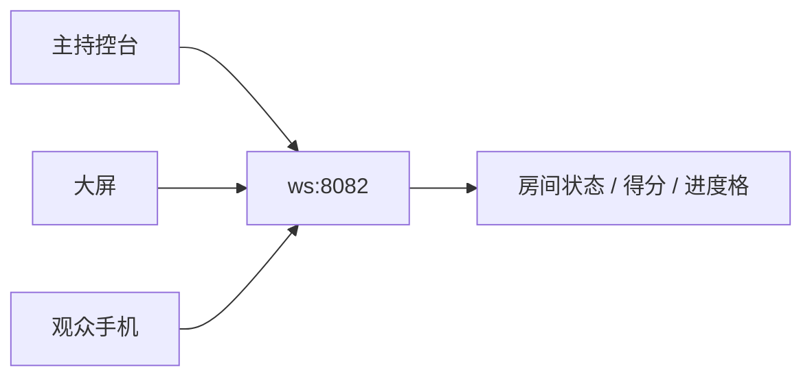

# quiz-live 暖场抢答框架

独立于 Reveal 主 deck 的现场抢答系统，对应分镜：**扫码登记 → 大屏同步 → 推送题目 → 统计公布 → 进度格计分**。

## 三端架构

| 端 | 文件 | 角色 |
|----|------|------|
| 观众手机 | `quiz-live/answer.html?room=XXXX` | 登记、答题、个人对错与领奖提示 |
| 现场大屏 | `quiz-live/screen.html?room=XXXX` | 在线人数、题目、柱状统计、12 格进度、解析 |
| 主持控台 | `quiz-live/admin.html?room=XXXX` | 二维码、推题、公布答案、得分表 |

实时同步经 **WebSocket 中继**（`quiz-live/scripts/quiz-ws-relay.js`，默认端口 **8082**）。



## 现场流程（对照分镜）

1. **控台**打开 `admin.html`，记下房间码，将二维码立牌给观众扫描。
2. 观众打开 `answer.html`，按 `register-config.json` 填写登记信息，获得编号（01、02…）。
3. 大屏打开同房间 `screen.html`，显示「全员在线」与参与者格。
4. 暖场：控台点 **暖场等候** 或 **发布说明**（观众端弹出规则）。
5. 控台 **推送下一题** → 手机与大屏同步题目与 30s 倒计时。
6. 观众选题并 **提交答案** → 服务端计分，大屏柱状图实时更新。
7. 控台 **显示统计** → **公布答案**（进度格打勾，解析上屏）。
8. 重复 5–7 直至 12 题；**结束活动** 后观众看到个人总分。

## 启动

```bat
quiz-live\start-quiz-server.bat
```

- HTTP：项目根目录 `8080`（与主 deck 相同）
- WebSocket：`8082`（勿与 `remoteNavigator` 的 `8081` 冲突）

本机控台：<http://localhost:8080/quiz-live/admin.html>

## 题库

编辑 `quiz-live/data/questions.json`：

- `rules`：观众端说明 bullet
- `questions[]`：`text`、`options`（A–D）、`correct`、`analysis`

改题后重启 `quiz-ws-relay.js` 以加载新题库。

## 观众登记配置（register-config.json）

观众扫码后的登记表单位于 `quiz-live/data/register-config.json`，由 `quiz-register-config.js` 读取并动态渲染。**无需改 HTML** 即可开关字段（如手机号、工号等）。

### 设计原则

| 原则 | 说明 |
|------|------|
| 配置驱动 | 表单项、校验、文案均来自 JSON，避免硬编码 |
| `enabled` 开关 | `false` 时字段不渲染、不校验、不提交 |
| `required` 独立 | 仅对 `enabled: true` 的字段生效 |
| 向后兼容 | WS `register` 消息同时带 `profile` 对象；`name` / `phone` 仍写入参与者主字段供大屏/控台显示 |
| 失败回退 | JSON 加载失败时使用内置默认（姓名必填 + 手机号选填） |

### 顶层字段

| 键 | 类型 | 说明 |
|----|------|------|
| `version` | number | 配置版本，预留迁移用 |
| `title` | string | 登记面板标题 |
| `submitLabel` | string | 提交按钮文案 |
| `fields` | array | 表单项列表（顺序即展示顺序） |
| `messages` | object | 校验提示模板，支持 `{label}` 占位 |

### `fields[]` 单项

| 键 | 类型 | 默认 | 说明 |
|----|------|------|------|
| `id` | string | — | 字段键名，写入 `profile[id]`；建议 `name` 保留作显示名 |
| `enabled` | boolean | `true` | `false` 时完全隐藏 |
| `required` | boolean | `false` | 是否必填 |
| `label` | string | `id` | 标签文案 |
| `type` | string | `text` | `text` / `tel` / `email` / `number` |
| `placeholder` | string | `""` | 输入框占位 |
| `autocomplete` | string | `off` | 浏览器自动填充 hint |
| `maxLength` | number | `64` | 最大长度（服务端截断 64） |
| `pattern` | string | — | 可选正则（如手机号 `^1\\d{10}$`） |
| `patternMessage` | string | — | 正则不通过时的提示 |

### 常用示例

**关闭手机号（仅登记姓名）：**

```json
{
  "id": "phone",
  "enabled": false
}
```

**手机号必填且校验 11 位：**

```json
{
  "id": "phone",
  "enabled": true,
  "required": true,
  "label": "手机号",
  "type": "tel",
  "placeholder": "请输入 11 位手机号",
  "pattern": "^1\\d{10}$",
  "patternMessage": "请输入 11 位手机号"
}
```

**新增工号字段：**

```json
{
  "id": "employeeId",
  "enabled": true,
  "required": true,
  "label": "工号",
  "type": "text",
  "placeholder": "例如 A1024",
  "maxLength": 16
}
```

### WebSocket 载荷

登记提交：

```json
{
  "type": "register",
  "clientId": "…",
  "profile": { "name": "张三", "phone": "13800138000" },
  "name": "张三",
  "phone": "13800138000"
}
```

房间状态里每位参与者含 `profile` 对象；控台得分表仍用 `name` 列，扩展字段可在后续导出功能中读取 `profile`。

修改 `register-config.json` 后刷新观众页即可生效（无需重启中继，除非要做服务端校验扩展）。

## 计分与进度格

- **个人得分**：每题答对 +1，汇总在控台得分表与大屏参与者 chip 的 `title` 提示中。
- **进度格**：`completedQuestions` 数组驱动 1–12 格；公布答案后当前题标记 ✓。
- **统计柱**：各选项人数，由每次 `submit` 广播 `stats_update`。

## 扩展

- 替换 QR 库或接入自有域名时，改 `QuizProtocol.buildAnswerUrl`。
- 若需与主 deck 同屏，可将 `screen.html` iframe 嵌入暖场幻灯片（注意 WS 端口可达）。
- 生产环境建议加 WSS 反向代理与房间鉴权；当前为 LAN 暖场原型。
